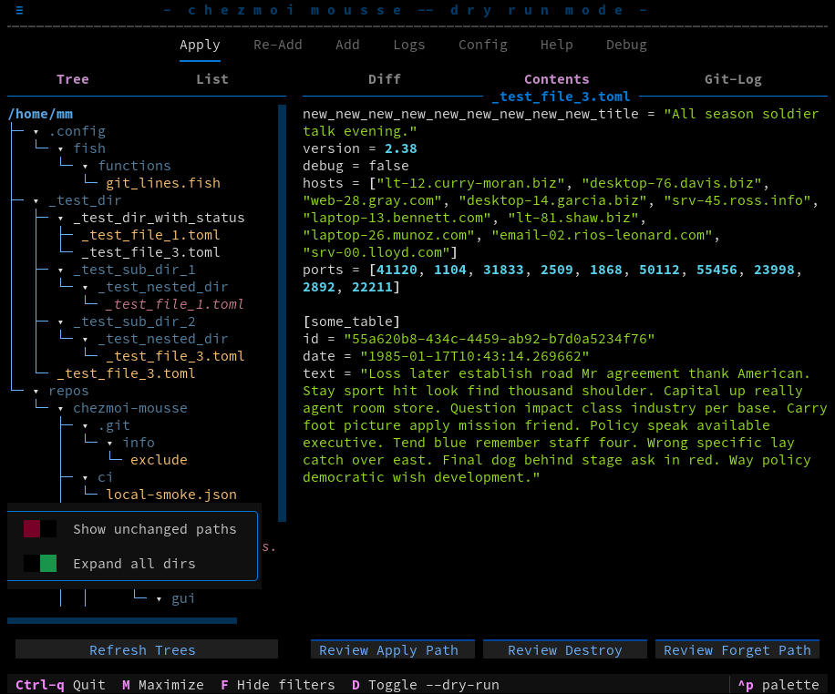
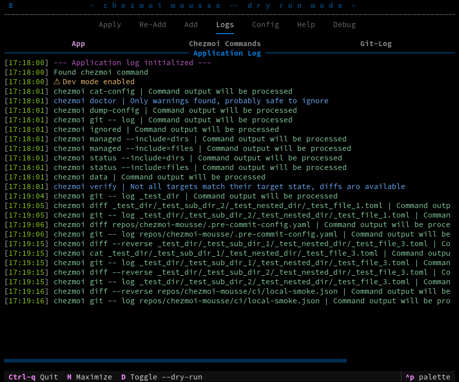
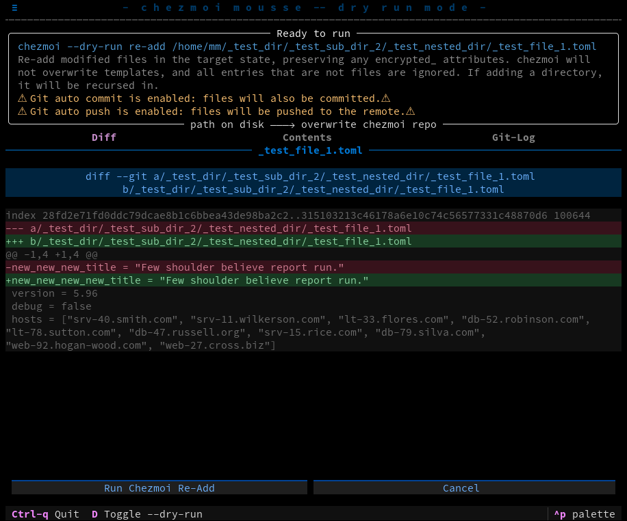
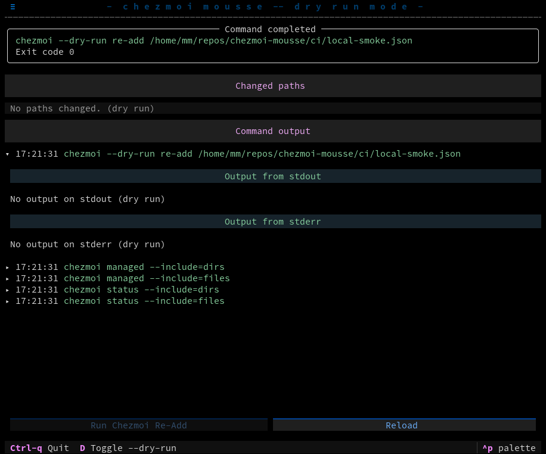
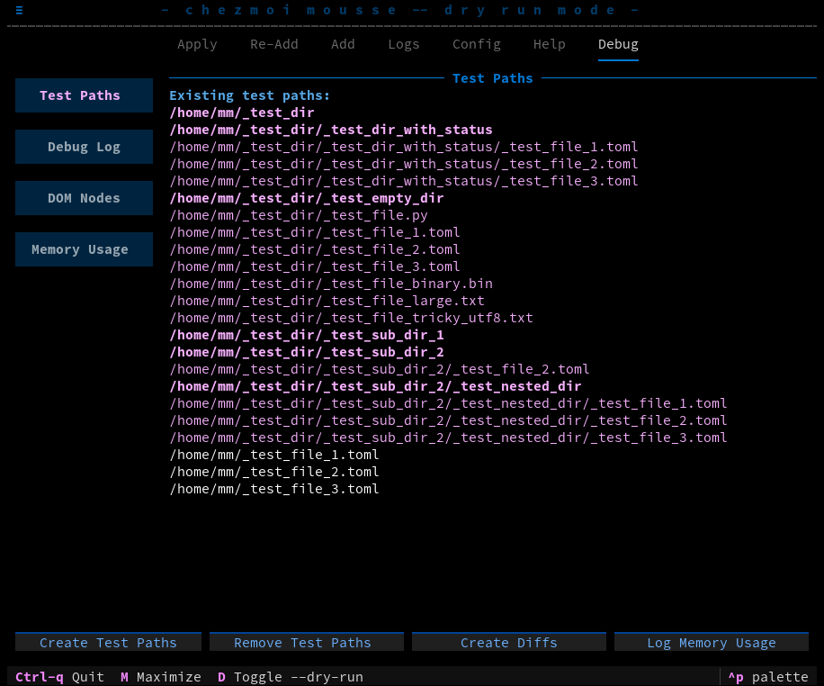
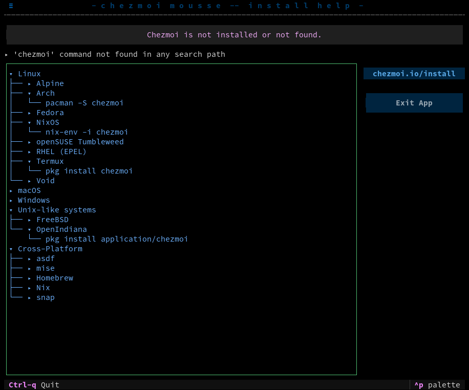

> [!WARNING]
> It's safe to use the app to visualize your `chezmoi` repository but before running any write operations, see the [Use Case][use-case-section] and [Test][test-section] section.
> Write operations need to be re-implemented after the most recent app overhaul.
> There are quite a bit of todo's and bugs left in the current state which will be solved soon, this project is work in progress.

Graphical user interface in the terminal for [chezmoi](https://github.com/twpayne/chezmoi), see the [chezmoi docs](https://www.chezmoi.io/).

The rich visualization is made possible thanks to [textual](https://github.com/Textualize/textual), see the [textual docs](https://textual.textualize.io/).

Commands are issued using [Python](https://www.python.org/) its [Subprocess management](https://docs.python.org/3/library/subprocess.html).

## Use Case

- Can be safely used to visualize your chezmoi repository, as no write operations are enabled by default.
- To enable operations, press `D`, `d` or click the `Toggle --dry-run` text in the footer. This will enable commands changing your config files or the chezmoi state. Test first in a VM or container, see the [Test][test-section] section.
- Run the app with your own user. Running the app with `sudo` or elevated permissions is **not needed** and **should be avoided**. Chezmoi [explicitly](https://www.chezmoi.io/user-guide/frequently-asked-questions/design/#can-i-use-chezmoi-to-manage-files-outside-my-home-directory) discourages operating outside of your home directory.
- The current implementation has only been used or tested with `autocommit` enabled, feedback is welcome on the issues page.

## Start

> Don't run the python command in a `chezmoi cd` invoked shell, unless you want to test.

On the command line, clone the repository:

`git clone https://github.com/matmaer/chezmoi-mousse.git`

Change directory into the `src` directory of the cloned repository.

`cd chezmoi-mousse` and `cd src`

The easiest way is to run the app with `uv`, [install uv](https://docs.astral.sh/uv/getting-started/installation/) on your platform. Then in the chezmoi-mousse src directory, run:

`uv run --no-dev --python 3.13 --with textual -m chezmoi_mousse`

If Python 3.13 with the latest `textual` version is available, and the module is in your PYTHONPATH, you can run:

`python -m chezmoi_mousse`

### App screenshot example

### App log example

### Operate review example

### Operate result example

## Test

To test the app without "real" dotfiles in a container or VM:

In the src directory of the cloned repository, you can run

`CHEZMOI_MOUSSE_DEV=1 uv run --no-dev --python 3.13 --with textual -m chezmoi_mousse`

Then on the "Debug" tab, you can generate some files in the home directory, and offer the possibility to modify the generated files to have diffs.
Files are generated using the `Faker` [package](https://faker.readthedocs.io/en/master/#)

### Platform packaging
- [x] Windows
  - [ ] app store
  - [ ] signed executable
  - [x] unpackaged
- [x] Apple
  - [ ] app store
  - [ ] signed executable
  - [x] unpackaged
- [x] Linux
  - [ ] [AppImage](https://appimage.org/)
  - [ ] briefcase
  - [ ] [flatpak](https://flatpak.org/)
  - [ ] public key list signed executable
  - [ ] [snap](https://snapcraft.io/)
  - [x] unpackaged

## Available Chezmoi commands

> Note: the lists for `Write Operations` and `Read Operations` below are a limited subset of available chezmoi commands, run `chezmoi help` in your terminal to see all commands.  Commands below without a checkmark are being implemented, missing commands could be out of scope or take a while.

### Write Operations

> Note: see `Implemented configuration options` below, not all flags are implemented, however usage with default flag values should run without errors. If you find an issue, please share it on the Issues tab.

- [ ] `chezmoi add` directory
- [ ] `chezmoi add` file
- [ ] `chezmoi archive`
- [ ] `chezmoi apply` directory
- [ ] `chezmoi apply` file
- [ ] `chezmoi destroy` directory
- [ ] `chezmoi destroy` file
- [ ] `chezmoi edit`
- [ ] `chezmoi forget` directory
- [ ] `chezmoi forget` file
- [ ] `chezmoi generate`
- [ ] `chezmoi import`
- [ ] `chezmoi init` new repository
- [ ] `chezmoi init` clone repository
- [ ] `chezmoi purge`
- [ ] `chezmoi re-add` directory
- [ ] `chezmoi re-add` file

### Read Operations

- [x] `chezmoi cat`
- [x] `chezmoi cat-config`
- [x] `chezmoi dump-config`
- [x] `chezmoi data`
- [x] `chezmoi diff`
- [x] `chezmoi doctor`
- [x] `chezmoi git log`
- [x] `chezmoi ignored`
- [x] `chezmoi managed`
- [x] `chezmoi source-dir`
- [x] `chezmoi status`
- [x] `chezmoi unmanaged`
- [x] `chezmoi verify`

### Implemented configuration options

**Legend:**

- :green_circle: Follow user configuration or chezmoi defaults
- :green_square: Providing flags for the `chezmoi` command, managed by this app.
- :negative_squared_cross_mark: Not in scope
- :bulb: Follows user config with warning
- :black_circle: Under development, help wanted or to be documented

Top level

- :green_circle: cacheDir
- :green_square: color (`--no-color`, app manages color)
- :green_circle: data
- :green_circle: destDir
- :black_circle: encryption
- :black_circle: env
- :green_circle: format
- :green_square: interactive (`--interactive=false`, app provides safeguards)
- :negative_squared_cross_mark: mode (`--mode=file`, only file mode is supported)
- :green_square: pager (`--no-pager`, app limits output)
- :green_square: pagerArgs
- :black_circle: persistentState
- :green_square: progress (`--progress=false`, app will implement spinner)
- :black_circle: scriptEnv
- :black_circle: scriptTempDir
- :green_circle: sourceDir
- :green_circle: tempDir
- :green_circle: umask
- :black_circle: useBuiltinAge
- :green_square: useBuiltinGit (`--use-builtin-git=true`)
- :green_square: verbose (all commands run with the `--verbose` flag)
- :black_circle: workingTree

add
- :black_circle: add.encrypt
- :black_circle: add.secrets
- :black_circle: add.templateSymlinks

age
- :black_circle: age.args
- :black_circle: age.command
- :black_circle: age.identities
- :black_circle: age.identity
- :black_circle: age.passphrase
- :black_circle: age.recipient
- :black_circle: age.recipients
- :black_circle: age.recipientsFile
- :black_circle: age.recipientsFiles
- :black_circle: age.suffix
- :black_circle: age.symmetric

awsSecretsManager
- :black_circle: awsSecretsManager.profile
- :black_circle: awsSecretsManager.region

azureKeyVault
- :black_circle: azureKeyVault.defaultVault

bitwarden
- :black_circle: bitwarden.command
- :black_circle: bitwarden.unlock

bitwardenSecrets
- :black_circle: bitwardenSecrets.command

cd
- :black_circle: cd.args
- :black_circle: cd.command

dashlane
- :black_circle: dashlane.args
- :black_circle: dashlane.command

diff
- :negative_squared_cross_mark: diff.args
- :green_square: diff.command (`chezmoi --use-builtin-diff`)
- :black_circle: diff.exclude
- :green_square: diff.pager (`chezmoi --no-pager --use-builtin-diff`)
- :negative_squared_cross_mark: diff.pagerArgs
- :green_square: diff.reverse
- :black_circle: diff.scriptContents

doppler
- :black_circle: doppler.args
- :black_circle: doppler.command
- :black_circle: doppler.config
- :black_circle: doppler.project

edit
- :black_circle: edit.apply
- :black_circle: edit.args
- :black_circle: edit.command
- :black_circle: edit.hardlink
- :black_circle: edit.minDuration
- :black_circle: edit.watch

ejson
- :black_circle: ejson.key
- :black_circle: ejson.keyDir

git
- :black_circle: git.autoAdd
- :bulb: git.autoCommit
- :bulb: git.autoPush
- :green_circle: git.command (`chezmoi git -- <git_command>` is used to run `git`)
- :green_circle: git.commitMessageTemplate
- :green_circle: git.commitMessageTemplateFile
- :black_circle: git.lfs

gitHub
- :black_circle: gitHub.refreshPeriod

gopass
- :black_circle: gopass.command
- :black_circle: gopass.mode

gpg
- :black_circle: gpg.args
- :black_circle: gpg.command
- :black_circle: gpg.recipient
- :black_circle: gpg.recipients
- :black_circle: gpg.suffix
- :black_circle: gpg.symmetric

hooks
- :black_circle: hooks.command.post.args
- :black_circle: hooks.command.post.command
- :black_circle: hooks.command.pre.args
- :black_circle: hooks.command.pre.command

interpreters
- :black_circle: interpreters.extension.args
- :black_circle: interpreters.extension.command

keepassxc
- :black_circle: keepassxc.args
- :black_circle: keepassxc.command
- :black_circle: keepassxc.database
- :black_circle: keepassxc.mode
- :black_circle: keepassxc.prompt

keeper
- :black_circle: keeper.args
- :black_circle: keeper.command

lastpass
- :black_circle: lastpass.command

merge
- :black_circle: merge.args
- :black_circle: merge.command

onepassword
- :black_circle: onepassword.cache
- :black_circle: onepassword.command
- :black_circle: onepassword.mode
- :black_circle: onepassword.prompt

pass
- :black_circle: pass.command

passhole
- :black_circle: passhole.args
- :black_circle: passhole.command
- :black_circle: passhole.prompt

pinentry
- :black_circle: pinentry.args
- :black_circle: pinentry.command
- :black_circle: pinentry.options

rbw
- :black_circle: rbw.command

secret
- :black_circle: secret.args
- :black_circle: secret.command

status
- :green_square: status.pathStyle
- :green_square: status.exclude

template
- :black_circle: template.options

textconv
- :black_circle: textconv

update
- :black_circle: update.apply
- :black_circle: update.args
- :black_circle: update.command
- :black_circle: update.recurseSubmodules

vault
- :black_circle: vault.command

verify
- :black_circle: verify.exclude

warnings
- :black_circle: warnings

### Chezmoi not found screenshot

If the `chezmoi` command is not available, a screen will be shown with the value for $PATH and a link to [chezmoi.io/install](https://chezmoi.io/install), along with parsed install commands from the [chezmoi repository](https://github.com/twpayne/chezmoi/blob/master/assets/chezmoi.io/docs/install.md.tmpl) which uses the excellent [Material for MkDocs](https://squidfunk.github.io/mkdocs-material/) framework.

[test-section]: #test
[use-case-section]: #use-case
